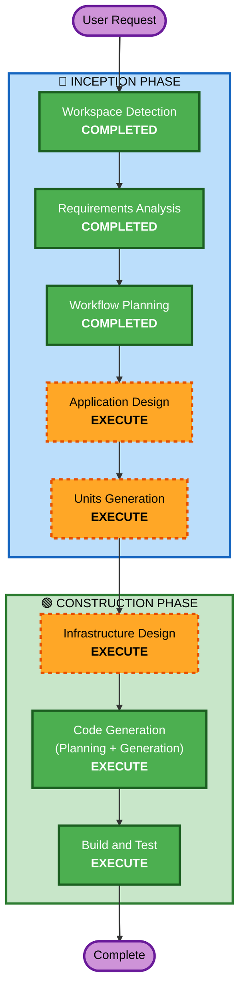

# Execution Plan

## Detailed Analysis Summary

### Project Context
- **Project Type**: Greenfield — Customer 360 Semantic Layer POC
- **PRD Reference**: research-output/PRD-AtScale-Customer360-SemanticLayer.md
- **IaC Tool**: AWS CDK (Python)
- **AWS Account**: 652341767951 (us-east-1)

### Change Impact Assessment
- **User-facing changes**: Yes — New chat application (Streamlit)
- **Structural changes**: Yes — Full infrastructure stack + application
- **Data model changes**: Yes — New schemas in Aurora + Redshift
- **API changes**: Yes — Agent tool interface to AtScale
- **NFR impact**: Minimal (POC targets: best-effort availability, <10s latency)

### Risk Assessment
- **Risk Level**: Medium
- **Rollback Complexity**: Easy (IaC + ephemeral resources)
- **Testing Complexity**: Moderate (multi-service integration)

---

## Workflow Visualization

---

## Phases to Execute

### 🔵 INCEPTION PHASE
- [x] Workspace Detection — COMPLETED (2026-07-13)
- [x] Reverse Engineering — SKIPPED (Greenfield project, no existing code)
- [x] Requirements Analysis — COMPLETED (PRD validated, CDK selected)
- [ ] User Stories — SKIP
  - **Rationale**: POC with single user, no personas needed. PRD §7 already defines functional requirements and sample queries
- [x] Workflow Planning — IN PROGRESS (this document)
- [ ] Application Design — EXECUTE
  - **Rationale**: Multiple components need identification (CDK stacks, data layer, AtScale config, agent, Streamlit app). Need to define service boundaries and interfaces
- [ ] Units Generation — EXECUTE
  - **Rationale**: System decomposes into 4 distinct units of work that can be built sequentially: infrastructure, data, semantic layer, application

### 🟢 CONSTRUCTION PHASE (Per-Unit)
- [ ] Functional Design — SKIP
  - **Rationale**: PRD §6-7 already provides sufficient functional detail (schemas, model structure, sample queries). Complexity is in infrastructure, not business logic
- [ ] NFR Requirements — SKIP
  - **Rationale**: POC scope with minimal NFR targets defined in PRD §8 (best-effort, <10s latency, no SLA)
- [ ] NFR Design — SKIP
  - **Rationale**: No NFR requirements stage executed
- [ ] Infrastructure Design — EXECUTE
  - **Rationale**: Multi-service AWS infrastructure needs formal design (VPC, EKS, Aurora, Redshift, S3, IAM)
- [ ] Code Generation — EXECUTE (ALWAYS)
  - **Rationale**: Primary implementation — CDK code, data scripts, agent code, Streamlit app
- [ ] Build and Test — EXECUTE (ALWAYS)
  - **Rationale**: Build verification, deployment instructions, integration testing

---

## Units of Work (Proposed)

| Unit | Name | Scope | Dependencies |
|------|------|-------|--------------|
| 1 | **Infrastructure** | CDK stacks: VPC, EKS, Aurora, Redshift, S3, IAM | None |
| 2 | **Data Layer** | CSV download, DDL scripts, data loading into Aurora + Redshift | Unit 1 |
| 3 | **Semantic Layer** | AtScale Helm deployment, data connections, SML model | Unit 1, Unit 2 |
| 4 | **Application** | Strands Agent + Streamlit chat app | Unit 1, Unit 3 |

---

## Estimated Timeline
- **Total Stages**: 7 (AD → UG → ID → CG×4 units → BT)
- **Estimated Duration**: This is a significant implementation; code generation will be the largest phase

## Success Criteria
- **Primary Goal**: End-to-end natural language query flow: User → Streamlit → Agent → AtScale → Aurora/Redshift → Answer
- **Key Deliverables**: CDK infrastructure, data loading scripts, AtScale model, Strands Agent, Streamlit app
- **Quality Gates**: All 13 sample queries (Q1-Q13) return correct results
